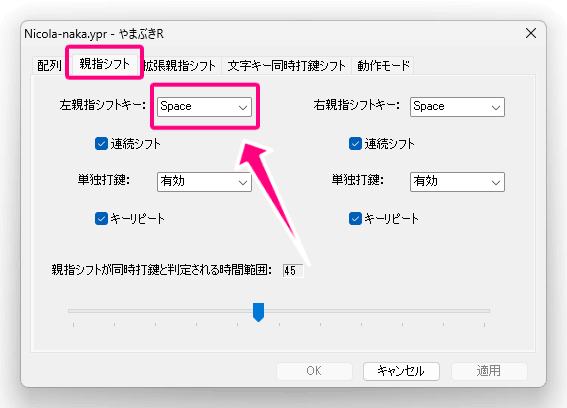

# Nicola-SandS

> [!Note]
> 中指同時シフト版の [Nicola-naka](https://github.com/ffunatsu/Nicola-naka) も制作していますので、あわせてご検討ください。 
> （Nicola-naka でもSandSが使えるので、実質的に上位互換になっています。）

親指シフト（Nicola）を、無変換・変換キーのないUSキーボードでも使えるように、**SandS（Space and Shift）化**したものです。

濁音と半濁音については、中指同時シフト（F/J、Dとの同時押し）を採用しています。

## 設定ファイル

- ＜Windows＞ やまぶきR用
  - [Nicola-SandS.yab](Nicola-SandS.yab) （**※ UTF-8ではなく、UTF-16LEまたはShift-JISで保存しないと正しく動きません。**）
    - やまぶきRの設定で、**スペースキーを左親指シフトに設定してください。**
      
- ＜Mac＞ Karbiner-Elements用
  - [Nicola-SandS.karabiner.json](Nicola-SandS.karabiner.json) (Complex modification用です。説明は割愛します。)
 
## 打ち方

- 非シフト面は親指シフト（Nicola）の定義通りです。
- SandS (Spaceシフト、スペースキーと文字キーの同時押し) により、「も」「お」などが
- 打てます。
  - なお、SandSなので、スペースキーは単打では通常のスペースキーと同じように動作します。
- 濁音は、F/J (人差し指) と反対側のキーを同時押しです。
  - 例えば:
    - J + S の同時押し → 「じ」
    - F + H の同時押し → 「ば」
  - 例外として、J + F の同時押しは「げ」で、 「ど」を打つには、J + K もしくは Q + J の同時押しをします。
- 半濁音は、F (またはD) と反対側のキーの同時押しです。
  - 例えば:
    - F (or D) + Y の同時押し → 「ぱ」
    - F (or D) + P の同時押し → 「ぴ」

## License

CC0 (Public Domain)
